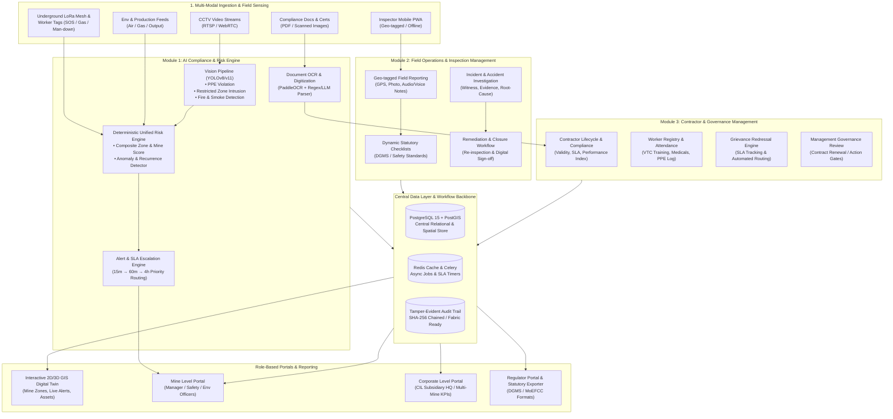

# AI MineGuard (SIH26024) — Master Architecture, Complete Workflow & Implementation Plan

AI MineGuard is an **Intelligent Mine Governance, Safety & Compliance Operating System** designed for Indian Coal Mines (CIL subsidiaries, SCCL, private/captive mines, and regulatory bodies like DGMS & MoEFCC). It replaces fragmented manual paperwork, spreadsheets, and delayed reporting with an automated, AI-driven, and evidence-backed governance ecosystem.

---

## 1. System Architecture & Complete End-to-End Workflow



---

## 2. Core Modules Functional Breakdown

### Module 1: AI Compliance & Risk Engine (Immediate Implementation Target)
1. **CCTV AI Safety Monitoring:**
   - Real-time video frame inference for PPE compliance (helmets, high-vis vests, boots).
   - Restricted-zone intrusion detection using PostGIS polygon geofencing.
   - Hazard detection: Fire, smoke, and unauthorized machinery access.
   - Candidate violation generation with automated confidence gating & deduplication windows.
2. **Equipment Compliance & OCR Digitization:**
   - Asset registry with unique QR code generation for field equipment.
   - Automated OCR parsing of statutory fitness certificates, calibration reports, and insurance documents.
   - Expiry tracking calendar with automated proactive alerts (30, 15, 7, 0 days).
3. **Safety, Environment & Production Monitoring:**
   - Daily/shift-wise fire safety inspections and environmental sensor ingestion ($CH_4$, $CO$, $O_2$, PM2.5/PM10, Noise).
   - Target vs. actual production variance tracking and downtime logging.
4. **Unified Risk Scoring & Anomaly Detection:**
   - Composite risk index computed per mine zone: $R = w_v V + w_e E + w_p P + w_s S$.
   - Recurrence detection (Isolation Forest / sliding-window rule) flagging habitual contractor/zone violations.
5. **Alerts, Corrective Actions & SLA Escalations:**
   - Multi-channel alerts (SMS, Email, Push, Webhook).
   - Automated 3-tier SLA escalation (Safety Officer $\to$ Mine Manager $\to$ Director Technical).
   - Corrective action lifecycle: `OPEN` $\to$ `IN_PROGRESS` $\to$ `PENDING_VERIFICATION` $\to$ `RESOLVED` $\to$ `CLOSED`.

### Module 2: Field Operations & Inspection Management
1. **Field Reporting & Mobile PWA:**
   - Offline-first inspection logging with IndexedDB sync upon network reconnection.
   - GPS coordinate stamping, camera photo capture with watermarked timestamps, and voice-to-text notes.
2. **Statutory Inspection Management:**
   - Digital DGMS inspection checklists (Quarterly, Pre-monsoon, Electrical, Machinery).
   - Assignment of inspection orders to qualified safety/environmental officers.
3. **Incident & Accident Management:**
   - Near-miss and accident logging with witness statements, severity rating, and root-cause taxonomy.
   - Corrective and Preventive Action (CAPA) tracking with photographic proof of rectification.

### Module 3: Contractor & Governance Management
1. **Contractor Lifecycle & Compliance Index:**
   - Contractor KYC, work order validity, statutory labour law compliance (EPF, ESI, CMPF).
   - Dynamic contractor safety scorecard affecting tender qualification and renewals.
2. **Workforce Governance & Training:**
   - Worker digital passport: Vocational Training Center (VTC) certifications, Periodic Medical Examination (PME), attendance records.
   - Gate-pass authorization linked to active PPE training and medical fitness validity.
3. **Grievance Redressal & Approval Workflows:**
   - Worker safety complaint logging with anonymous submission option.
   - Strict resolution SLA timers and audit-tracked management escalation.

### Hardware / Telemetry Layer: Underground LoRa & Worker Safety
- **Worker Wearable Tag:** LoRa transmitter, SOS emergency button, 3-axis accelerometer for man-down/fall detection.
- **Underground LoRa Repeater Nodes:** Multi-hop mesh network placed every 250m–500m in mine galleries with integrated toxic gas sensors ($CH_4$, $CO$, $O_2$).
- **Surface Gateway & Integration:** LoRaWAN Gateway at pithead relaying real-time telemetry packets via REST/MQTT into the backend ingestion engine.

---

## 3. Technology Stack & Directory Manifest

### Recommended Tech Stack
| Tier | Technology | Rationale |
|---|---|---|
| **Backend API** | FastAPI (Python 3.11+) | Asynchronous, high performance, auto-generated OpenAPI docs, native ML integration |
| **Database** | PostgreSQL 15 + PostGIS | Relational integrity for statutory audit trails + spatial polygons for mine zones |
| **Cache & Task Queue** | Redis + Celery | High-throughput asynchronous OCR, vision inference dispatch, and SLA escalation timers |
| **AI / Vision** | YOLOv8 / YOLOv11 (PyTorch) + OpenCV | High-FPS object & PPE detection, bounding box polygon math |
| **OCR & NLP** | PaddleOCR / Tesseract + regex/LLM | Accurate multi-lingual Indian certificate extraction & key-value parsing |
| **Anomaly ML** | Scikit-learn (Isolation Forest, Z-score) | Deterministic and explainable anomaly detection for regulatory transparency |
| **Frontend / Web App** | React / Vite + Vanilla CSS (Glassmorphic Dark UI) | Ultra-premium, responsive UI with interactive Leaflet GIS Digital Twin & Recharts |
| **Mobile PWA** | React PWA + IndexedDB + Service Worker | Offline-first field inspection reporting with GPS & media capture |

### Project Directory Layout
```
sih/
├── backend/
│   ├── app/
│   │   ├── main.py                     # FastAPI entrypoint with CORS, middlewares & routers
│   │   ├── core/
│   │   │   ├── config.py               # Settings, environment variables, security keys
│   │   │   ├── database.py             # SQLAlchemy 2.0 async engine & session factory
│   │   │   └── security.py             # JWT authentication, password hashing & RBAC
│   │   ├── models/                     # SQLAlchemy Models
│   │   │   ├── base.py                 # Base model with UUIDs, timestamps & audit mixins
│   │   │   ├── cctv_models.py          # CameraRegistry, DetectionEvent
│   │   │   ├── compliance_models.py    # Violation, StatutoryRule
│   │   │   ├── equipment_models.py     # EquipmentAsset, EquipmentDocument
│   │   │   ├── environment_models.py   # EnvironmentalReading, GasThreshold
│   │   │   ├── production_models.py    # ProductionRecord, ShiftTarget
│   │   │   ├── risk_models.py          # RiskScore, ZoneRiskFactor, Anomaly
│   │   │   ├── workflow_models.py      # Alert, CorrectiveAction, EscalationChain
│   │   │   ├── inspection_models.py    # (Module 2) InspectionChecklist, FieldReport, Incident
│   │   │   └── contractor_models.py    # (Module 3) Contractor, Worker, Grievance
│   │   ├── schemas/                    # Pydantic v2 validation schemas
│   │   │   ├── cctv_schemas.py
│   │   │   ├── compliance_schemas.py
│   │   │   ├── equipment_schemas.py
│   │   │   ├── environment_schemas.py
│   │   │   ├── production_schemas.py
│   │   │   ├── risk_schemas.py
│   │   │   └── workflow_schemas.py
│   │   ├── services/                   # Business Logic & Orchestrators
│   │   │   ├── cctv_service.py         # Confidence gating & violation promotion
│   │   │   ├── equipment_service.py    # Asset management & OCR pipeline triggers
│   │   │   ├── environment_service.py  # Gas readings & threshold breach evaluation
│   │   │   ├── production_service.py   # Target vs actual variance computing
│   │   │   ├── risk_engine_service.py  # Composite score computation (formula 3.3)
│   │   │   ├── anomaly_service.py      # Recurrence & statistical anomaly detection
│   │   │   ├── alert_service.py        # Alert generation & multi-channel notification
│   │   │   └── escalation_service.py   # SLA timer monitoring & automated escalation
│   │   ├── ai/                         # AI Models & Pipelines
│   │   │   ├── vision/
│   │   │   │   ├── yolo_detector.py    # YOLOv8 PPE, zone intrusion & fire/smoke wrapper
│   │   │   │   └── stream_processor.py # RTSP/Video stream frame sampler
│   │   │   ├── ocr/
│   │   │   │   ├── ocr_engine.py       # Tesseract/PaddleOCR text extraction
│   │   │   │   └── certificate_parser.py # Regex/LLM parser for equipment & medical certs
│   │   │   └── risk/
│   │   │       ├── risk_calculator.py  # Deterministic weighted risk score calculator
│   │   │       └── anomaly_detector.py # Isolation forest & sliding-window recurrence
│   │   ├── routers/v1/                 # API Endpoints
│   │   │   ├── auth_router.py          # /api/v1/auth
│   │   │   ├── cctv_router.py          # /api/v1/mine/cameras, /detections
│   │   │   ├── compliance_router.py    # /api/v1/mine/violations
│   │   │   ├── equipment_router.py     # /api/v1/mine/equipment, /documents
│   │   │   ├── environment_router.py   # /api/v1/mine/environmental-readings
│   │   │   ├── production_router.py    # /api/v1/mine/production-records
│   │   │   ├── risk_router.py          # /api/v1/mine/risk-scores, /anomalies
│   │   │   ├── workflow_router.py      # /api/v1/mine/alerts, /corrective-actions
│   │   │   └── telemetry_router.py     # /api/v1/mine/telemetry (LoRa/Worker SOS ingestion)
│   │   └── workers/                    # Background Workers & Schedulers
│   │       ├── escalation_timer.py     # Periodic 5-minute SLA breach evaluator
│   │       ├── expiry_scheduler.py     # Daily asset certificate expiry checker
│   │       └── anomaly_scheduler.py    # Recurring violation scanner
│   ├── alembic/                        # Database Migrations
│   ├── tests/                          # Pytest test suite for APIs and AI pipelines
│   └── requirements.txt
│
└── frontend/                           # Interactive Web Portal & Digital Twin
    ├── index.html
    ├── src/
    │   ├── main.jsx
    │   ├── App.jsx
    │   ├── index.css                   # Custom CSS Design System (Glassmorphic Coal-Theme)
    │   ├── components/                 # Reusable UI components (Sidebar, Topbar, KPI Cards)
    │   ├── pages/
    │   │   ├── DashboardPage.jsx       # Real-time Executive Overview & Live Feeds
    │   │   ├── DigitalTwinPage.jsx     # 2D/3D GIS Mine Map with Zone Heatmaps & Sensors
    │   │   ├── CCTVMonitoringPage.jsx  # Live AI Camera Grid with Real-time Bounding Boxes
    │   │   ├── CompliancePage.jsx      # Violation Registry, Evidence Modal & Approvals
    │   │   ├── EquipmentPage.jsx       # Asset QR Manager & Document OCR Scanner
    │   │   ├── EnvironmentalPage.jsx   # Gas Telemetry, LoRa Worker Tracking & SOS Map
    │   │   ├── RiskEnginePage.jsx      # Explainable Risk Scoring & Anomaly Inspector
    │   │   ├── InspectionsPage.jsx     # Field Checklists & Officer Assignments
    │   │   └── GovernancePage.jsx      # Contractor Index, Workforce Passport & Grievances
    │   └── services/api.js             # Axios API client connecting to FastAPI backend
    └── package.json
```

---

## 4. User Review Required

> [!IMPORTANT]
> **Implementation Phase 1 Focus (Module 1 - Sensing & Risk Core + Integrated Demo UI):**
> We will immediately scaffold and build the complete working **Module 1 (AI Compliance & Risk Engine)** along with the **Central FastAPI Backend**, **Database Models**, **AI Inference Engines (YOLO PPE/Zone/Fire simulation + OCR Certificate extraction + Risk/Anomaly calculators)**, and a **Stunning Modern Glassmorphic Dashboard & GIS Digital Twin** connecting to all endpoints.

> [!NOTE]
> **Database Configuration:**
> For fast local development and instant hackathon demonstration, we will default to SQLite (with async SQLAlchemy) or PostgreSQL if local credentials are provided, ensuring zero installation friction while remaining 100% production-ready for PostgreSQL/PostGIS.

---

## 5. Open Questions
1. Do you have a local PostgreSQL instance running that you would like to connect to, or should we use SQLite with spatial JSON simulation for the local MVP?
2. Do you have pre-recorded sample mine video files / certificate images you'd like to place in a demo folder, or should we bundle synthetic test assets for the initial run?

---

## 6. Detailed Step-by-Step Implementation Roadmap

### Phase 1: Backend Architecture & Core Module 1 (Sprints 1–3)
- `[NEW]` [backend/requirements.txt](file:///c:/Users/kharj/sih/backend/requirements.txt): FastAPI, Uvicorn, SQLAlchemy, Pydantic, OpenCV, PyTorch/Ultralytics, PaddleOCR/Tesseract, Scikit-learn, etc.
- `[NEW]` [backend/app/main.py](file:///c:/Users/kharj/sih/backend/app/main.py): FastAPI app with modular v1 routers and CORS.
- `[NEW]` [backend/app/core/](file:///c:/Users/kharj/sih/backend/app/core/): Database engine, settings, RBAC definitions.
- `[NEW]` [backend/app/models/](file:///c:/Users/kharj/sih/backend/app/models/): Full schema definitions (CCTV, Violations, Equipment Assets, Documents, Readings, Risk Scores, Anomalies, Alerts, Corrective Actions).
- `[NEW]` [backend/app/schemas/](file:///c:/Users/kharj/sih/backend/app/schemas/): Pydantic input/output schemas with validation rules.
- `[NEW]` [backend/app/services/](file:///c:/Users/kharj/sih/backend/app/services/):
  - `cctv_service.py`: Candidate promotion, confidence gating (>0.75), deduplication window (30s).
  - `equipment_service.py`: Asset QR generation, OCR document trigger.
  - `risk_engine_service.py`: Zone-wise and mine-level deterministic risk computation.
  - `anomaly_service.py`: Recurring violation detection algorithm.
  - `alert_service.py` & `escalation_service.py`: Multi-tier SLA escalation timers.
- `[NEW]` [backend/app/ai/](file:///c:/Users/kharj/sih/backend/app/ai/):
  - `yolo_detector.py`: Synthetic & YOLOv8 inference for PPE, Zone Intrusion, Fire/Smoke.
  - `ocr_engine.py` & `certificate_parser.py`: Statutory certificate parsing.
  - `anomaly_detector.py`: Isolation Forest / Z-score risk anomaly model.
- `[NEW]` [backend/app/routers/v1/](file:///c:/Users/kharj/sih/backend/app/routers/v1/): Complete REST API endpoints matching the specification catalogue.

### Phase 2: High-Performance Frontend & GIS Digital Twin UI
- `[NEW]` [frontend/package.json](file:///c:/Users/kharj/sih/frontend/package.json): React + Vite + Lucide Icons + Leaflet GIS + Recharts.
- `[NEW]` [frontend/src/index.css](file:///c:/Users/kharj/sih/frontend/src/index.css): Dark coal-mining aesthetic with vibrant safety orange, emerald, and amber status indicators, glassmorphism, and micro-animations.
- `[NEW]` [frontend/src/pages/DashboardPage.jsx](file:///c:/Users/kharj/sih/frontend/src/pages/DashboardPage.jsx): Live KPI counters, real-time alert feed, active incident ticker.
- `[NEW]` [frontend/src/pages/DigitalTwinPage.jsx](file:///c:/Users/kharj/sih/frontend/src/pages/DigitalTwinPage.jsx): Interactive Mine Map with zones, live worker LoRa nodes, camera feeds, and gas heatmaps.
- `[NEW]` [frontend/src/pages/CCTVMonitoringPage.jsx](file:///c:/Users/kharj/sih/frontend/src/pages/CCTVMonitoringPage.jsx): Multi-camera live view with bounding box overlays and instant violation trigger demo.
- `[NEW]` [frontend/src/pages/EquipmentPage.jsx](file:///c:/Users/kharj/sih/frontend/src/pages/EquipmentPage.jsx): Asset registry with live OCR certificate scanner and expiry tracker.
- `[NEW]` [frontend/src/pages/RiskEnginePage.jsx](file:///c:/Users/kharj/sih/frontend/src/pages/RiskEnginePage.jsx): Explainable risk score breakdown and recurring anomaly graphs.

### Phase 3: Field Inspection (Module 2) & Governance/Contractors (Module 3)
- Expand data models & API routes for Mobile Checklists, Incident Investigation, Contractor Scorecards, Worker Gate-pass & Grievance SLA tracking.

---

## 7. Verification Plan

### Automated Tests
- **API Functional Tests:** Run `pytest backend/tests/` to verify:
  1. CCTV detection ingestion and violation promotion logic (confidence thresholds and deduplication).
  2. OCR parsing and asset expiry date auto-update.
  3. Risk score calculation matching the deterministic formula.
  4. SLA escalation timer transitions.
- **AI Pipeline Tests:** Validate mock vision frame inference, polygon point-in-polygon intrusion checks, and OCR text extraction.

### Manual Verification
1. Launch Backend API (`uvicorn app.main:app --reload`) and verify Swagger documentation at `http://localhost:8000/docs`.
2. Launch Frontend Dev Server (`npm run dev`) and test interactive workflows:
   - Trigger a simulated CCTV PPE/Zone violation $\to$ verify violation entry and risk score update.
   - Upload a mock equipment certificate $\to$ verify OCR extracted fields and calendar update.
   - Trigger worker SOS / Gas alert $\to$ verify emergency banner and escalation log.
